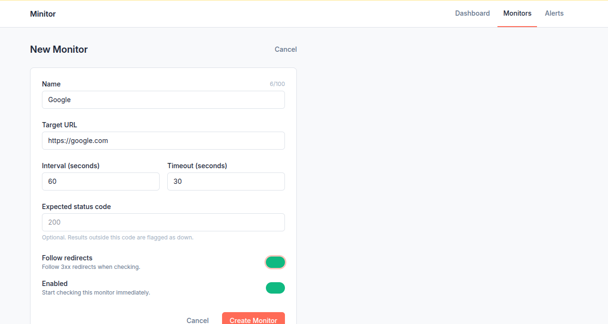
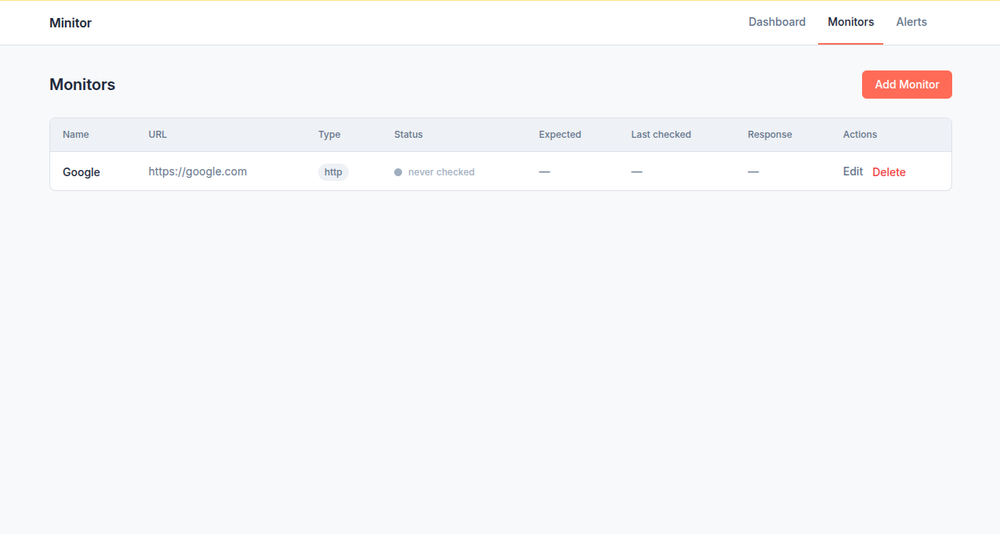
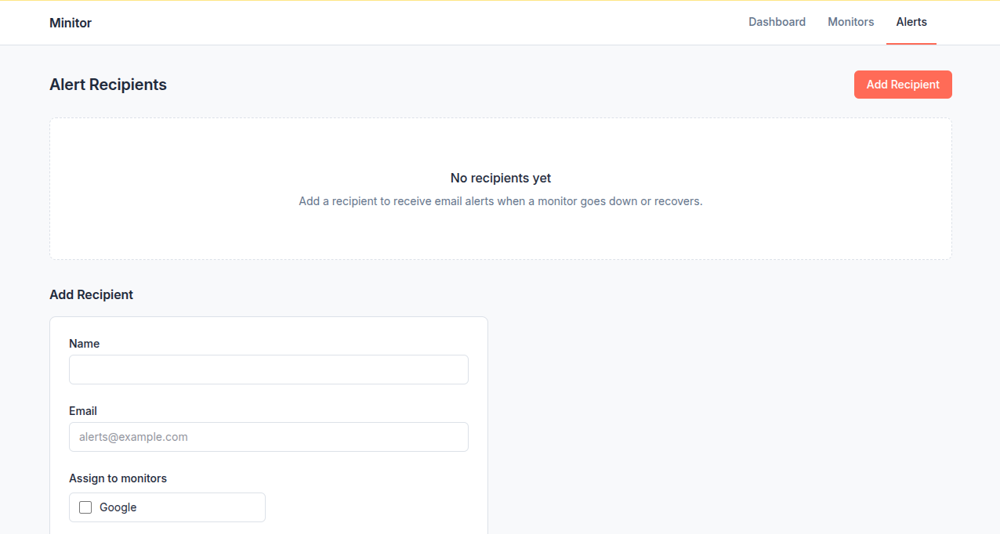
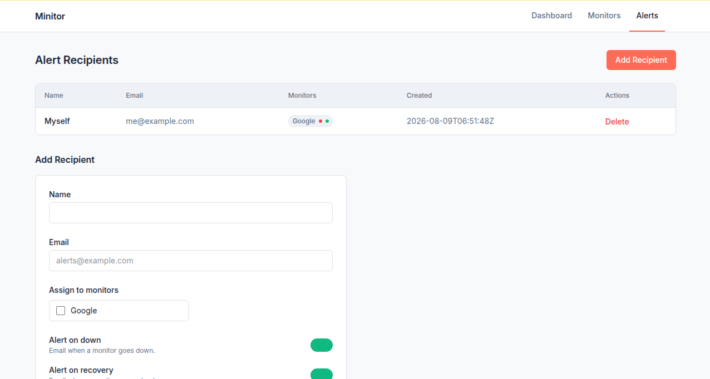

# Minitor

Minitor is a self-hosted, single-binary monitoring tool for small deployments. It performs scheduled HTTP and ping health checks against configured endpoints, stores results in SQLite, and sends email alerts via SMTP when monitors go down or recover. The entire application ships as a statically compiled Go binary with zero runtime dependencies beyond the binary itself and a writable directory for the database.

## Screenshots

### Dashboard

An empty dashboard prompts you to add your first monitor:


The add-monitor form:



Added monitors show as status cards with a live status indicator (green when up, pulsing red when down), target URL, last response time, and last checked timestamp:



### Alert recipients

The recipients page starts empty next to the add form:



After adding, recipients are listed with their linked monitors:



## Features

- **HTTP health checks** — probe any URL with configurable timeout, optional redirect following, and optional expected status code matching beyond plain 2xx.
- **Ping probes** — ICMP ping with automatic TCP fallback for environments without raw socket access (e.g. containers). _Planned — the scheduler logs a warning and does not yet execute ping probes._
- **Scheduled probing** — per-monitor intervals with random start jitter to avoid thundering herd on startup.
- **Runtime monitor management** — add, remove, enable, and disable monitors without restarting.
- **SQLite storage** — single-file database in WAL mode, no external database server required. Backups are a file copy.
- **Live dashboard** — HTMX-powered dashboard that polls every 30 seconds, no full page reloads.
- **Monitor CRUD** — full create/read/update/delete via the web UI with server-side form validation.
- **Email alerts** — plain-text SMTP alerts on down and recovery transitions, with per-recipient consecutive-failure thresholds.
- **Alert recipients** — manage recipients by name and email and link them to one or more monitors.
- **Optional authentication** — set `ADMIN_PASSWORD` to protect the dashboard with an HMAC-signed session cookie; leave it unset for a completely open instance.
- **Health check endpoint** — `GET /api/status` returns `{"status":"ok"}` for external monitoring of Minitor itself.
- **Responsive UI** — TailwindCSS with HTMX and Alpine.js; no heavy JavaScript framework.
- **Graceful shutdown** — clean shutdown on SIGTERM/SIGINT with a 30-second timeout.
- **Structured logging** — `key=value` logs via `log/slog` to stdout, ready to pipe into any log aggregator.

## Quickstart

Download the latest binary for your platform from the [releases page](https://github.com/confuzeus/minitor/releases):

```bash
curl -L -o minitor https://github.com/confuzeus/minitor/releases/latest/download/minitor-linux-amd64
chmod +x minitor
```

Set your environment variables, then run:

```bash
export DATA_DIR=/var/lib/minitor
./minitor
```

That's it. Open http://localhost:8080, create a monitor, and Minitor starts probing immediately.

### Enabling authentication and email alerts

```bash
export ADMIN_PASSWORD=changeme
export SECRET_KEY=$(openssl rand -hex 32)

export SMTP_HOST=smtp.example.com
export SMTP_PORT=587
export SMTP_USERNAME=user@example.com
export SMTP_PASSWORD=changeme
export SMTP_FROM=minitor@example.com

./minitor
```

> **Note:** SMTP configuration is all-or-nothing. If any `SMTP_*` variable is set, all five must be provided, otherwise the app fails to start. Omit all of them to disable email alerting.

For a full list of variables, see the [environment variable reference](#environment-variables).

## Docker

The repository includes a multi-stage `Dockerfile` that produces a minimal distroless image running as a non-root user, and a `docker-compose.yml` for one-command setup.

Pre-built images are published on Docker Hub at `dockershepherd/minitor`. Pull the latest release with:

```bash
docker pull dockershepherd/minitor:latest
```

To run the image directly:

```bash
docker run -d --name minitor \
  -p 8080:8080 \
  -v minitor-data:/data \
  -e DATA_DIR=/data \
  dockershepherd/minitor:latest
```

Minitor is now available at http://localhost:8080. Edit `environment:` in `docker-compose.yml` to enable authentication, SMTP, or other options. Data persists in the `minitor-data` Docker volume at `/data`.

To instead build and tag a specific version locally from source:

```bash
docker build --build-arg VERSION=0.1.0 -t minitor:0.1.0 .
```

## systemd

Copy the provided unit file and the binary into place:

```bash
sudo cp contrib/minitor.service /etc/systemd/system/
sudo cp minitor /usr/local/bin/minitor
```

Create an environment file with your configuration:

```bash
sudo mkdir -p /etc/minitor
sudo cp contrib/minitor.env.example /etc/minitor/minitor.env
sudo systemctl edit --runtime minitor   # or edit /etc/minitor/minitor.env directly
```

Uncomment the `EnvironmentFile=` line in `/etc/systemd/system/minitor.service` if you want the env file loaded, then enable and start:

```bash
sudo systemctl daemon-reload
sudo systemctl enable --now minitor
```

The unit runs as an ephemeral system user with `StateDirectory=minitor`, so `/var/lib/minitor` (the default `DATA_DIR`) is created and owned automatically. It also ships with extensive sandboxing enabled (`ProtectSystem=strict`, `NoNewPrivileges=yes`, `MemoryDenyWriteExecute=yes`, and more).

Check status and logs:

```bash
journalctl -u minitor -f
```

## Environment variables

All configuration is done through environment variables. There is no config file and no settings UI.

Minitor auto-loads a `.env` file (plus an optional `.env.local` override) from the current working directory at startup, so you can keep configuration out of the shell. Real environment variables always take precedence over `.env` values, and `.env.local` overrides `.env`. A missing or malformed auto-loaded `.env` is logged as a warning rather than a startup failure; pass `--env-file /path/to/file` to load from a different location (errors on an explicitly requested file are fatal), or `--env-file ""` to disable loading. Note that `$VAR` expansion happens per-file, so `.env.local` values cannot reference variables defined in `.env`.

| Variable         | Default        | Description                                                                                                                      |
| ---------------- | -------------- | -------------------------------------------------------------------------------------------------------------------------------- |
| `PORT`           | `8080`         | HTTP listen port                                                                                                                 |
| `DATA_DIR`       | `./data`       | Directory for persistent data; the SQLite database lives at `<DATA_DIR>/minitor.db`                                              |
| `ADMIN_PASSWORD` | _(empty)_      | If set, the dashboard requires login; if empty, the app is completely open                                                       |
| `SECRET_KEY`     | auto-generated | HMAC-SHA256 key used to sign session cookies. If unset, a random key is generated and sessions are invalidated on restart        |
| `SECURE_COOKIES` | `false`        | Set to `true` to add the `Secure` flag to cookies (requires HTTPS, e.g. behind a reverse proxy)                                  |
| `RETENTION_DAYS` | `30`           | Number of days to retain probe results; must be at least `1`. Parsed and validated, but automatic pruning is not yet implemented |
| `SMTP_HOST`      | _(empty)_      | SMTP server hostname                                                                                                             |
| `SMTP_PORT`      | _(empty)_      | SMTP server port                                                                                                                 |
| `SMTP_USERNAME`  | _(empty)_      | SMTP authentication username                                                                                                     |
| `SMTP_PASSWORD`  | _(empty)_      | SMTP authentication password                                                                                                     |
| `SMTP_FROM`      | _(empty)_      | From address used for alert emails                                                                                               |

**Validation rules**

- `PORT` and `DATA_DIR` must not be empty.
- `RETENTION_DAYS` must be a valid integer of at least `1`.
- `SECURE_COOKIES` must be `true` or `false`.
- SMTP is all-or-nothing: if any `SMTP_*` variable is set, all five must be set.

## Architecture

Minitor is a single binary with zero runtime dependencies. It uses an embedded SQLite database (`modernc.org/sqlite`, no CGO), a timer-based probe scheduler that manages one ticker per monitor, and a stateless alert engine that detects up/down transitions by querying probe history. The frontend is server-rendered HTML with HTMX partial updates and Alpine.js for client-side state. Templates, CSS, and database migrations are all embedded into the binary via `go:embed`.

See the [architecture document](.agents/skills/architecture/SKILL.md) for the full design: data model, API routes, security model, probe and alert engine details, and the frontend architecture.

## Development

### Prerequisites

- [Go](https://go.dev/dl/) 1.25+
- [Node.js](https://nodejs.org/) and npm (only for the TailwindCSS build step)
- [just](https://github.com/casey/just) (optional — see the plain commands below)

### Setup

```bash
git clone https://github.com/confuzeus/minitor.git
cd minitor
npm ci          # install the TailwindCSS CLI
```

### Commands

| Command      | Description                                              |
| ------------ | -------------------------------------------------------- |
| `just dev`   | Run the server in dev mode (`go run . -data-dir ./data`) |
| `just build` | Full build: compile CSS, then the Go binary              |
| `just test`  | Run all Go tests (`go test ./...`)                       |
| `just css`   | Rebuild the TailwindCSS output only                      |

Without `just`:

```bash
go run . -data-dir ./data   # dev
go build -o minitor .       # build
go test ./...               # test
```

The compiled CSS must exist before building the binary, since it is embedded via `go:embed`. Run `npm run build:css` first if you changed any styles or templates. Note that Tailwind only generates utility classes it finds in the templates, so rebuild after editing templates too.

### Project layout

```
main.go                  # Entry point: load settings, open DB, start scheduler + server
embed.go                 # go:embed directives for templates and static assets
internal/
  settings/              # Environment variable parsing and validation
  database/              # SQLite open/configure/migrate
  models/                # Monitors, probe results, alert recipients
  probe/                 # Scheduler + HTTP/ping probe engines
  alerter/               # State detection and SMTP email sending
  auth/                  # Session cookies and auth middleware
  handlers/              # HTTP handlers and JSON API
  templates/             # Server-rendered HTML templates
static/
  css/                   # TailwindCSS source
  dist/                  # Compiled CSS (embedded into the binary)
contrib/
  minitor.service        # systemd unit file
```

### CLI flags

| Flag         | Default                 | Description                      |
| ------------ | ----------------------- | -------------------------------- |
| `--port`     | `8080`                  | HTTP listen port                 |
| `--data-dir` | `./data`                | Directory for persistent data    |
| `--db-path`  | `<data-dir>/minitor.db` | Path to the SQLite database      |
| `--migrate`  | —                       | Run database migrations and exit |
| `--version`  | —                       | Print version and exit           |
